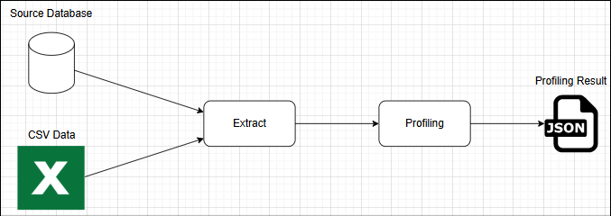
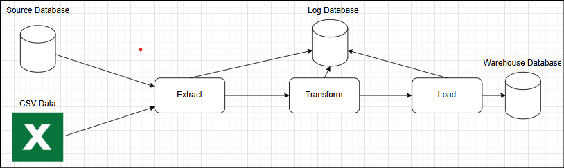

# Data Integration and ETL Pipeline

## Table of Contents

* [Project Description](#project-description)
* [Data Sources](#data-sources)
* [Problem Statement](#problem-statement)
* [Solution Approach](#solution-approach)

## Project Description

This project aims to process raw customer, transaction and marketing campaign data and transform it into a structured
format optimized for a data warehouse.
The objective is to ensure data quality, consistency, efficiency and enabling accurate reporting.

## Data Sources

The project uses the following data sources:

1. Source Database

- education_status: Contains different levels of education.
- marital_status: Stores marital status categories.
- marketing_campaign_deposit: Holds details about marketing campaigns and customer interactions.

2. CSV Files

- transactions: Records customer transactions, including date, time, and amount.

## Problem Statement

During the data transformation process, several challenges must be addressed:

- Data Distribution Across Multiple Sources: The data originates from both a structured source database and CSV files,
  requiring integration and consistency.
- Handling Large Data Volumes: Processing massive files and datasets can strain computational resources and impact
  performance.
- Data Structure and Suitability: Raw data may not be immediately structured in a format suitable for analysis,
  necessitating transformation and optimization.

## Solution Approach

### 1. Data Profiling

Before performing the ETL process, data profiling is conducted to assess:

- Missing Values: Identify null or empty fields that need to be handled via imputation, removal, or default values.
- Data Type Inconsistencies: Ensure fields are stored in appropriate formats (e.g., dates, numeric values, categorical
  data).

These insights guide the ETL process by informing necessary transformations such as data cleansing, standardization, and
restructuring.

### 2. ETL Process

To ensure seamless data transformation and integration, the following structured ETL approach is implemented:

#### Extract

- Fetch structured data from the source database.
- Read customer and transaction data from CSV files.

#### Transform

- Map raw data fields to standardized formats suitable for the data warehouse.

#### Load

- Insert transformed data into optimized warehouse tables.
- Ensure data integrity by maintaining relationships between entities.

### 3. Data Pipeline Design

### Profiling Data

### Warehouse Pipeline

